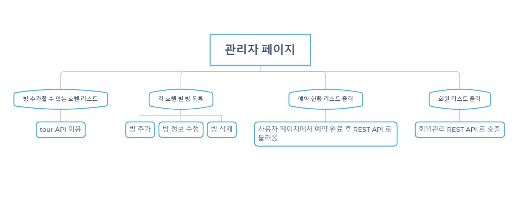

# Spring-study-note
> 스프링 프레임워크 공부 노트 + 프로젝트 

## 숙박 중개 플랫폼, Bitcamp 프로젝트 - 관리자 페이지 

#### 소스코드 
* [전체 소스코드](https://github.com/kytsaaa6/Bitcamp)
* [개인 소스코드 - 서버](https://github.com/Miniminis/Spring-study-note/tree/master/BitcampServer)
* [개인 소스코드 - 클라이언트](https://github.com/Miniminis/Spring-study-note/tree/master/BitcampClient/WebContent)

#### 흐름도
* 전체 : 

* 관리자 페이지 : 

#### 기술/구조
* 웹 표준 
    * `HTML5`
    * `CSS3`
    * `JavaScript`
    * `jQuery`
    * `Bootstrap4`
* TOMCAT 컨테이너 사용
* DBMS - `MySQL`
* Spring Framework
* `MyBatis`
* 한국 관광공사 tour API 사용 : 숙박 정보 가져옴
    * `jQuery`, `aJax`, `JSON` 파싱
* `RESTful Api 구조`  
    * 서버 <--> 클라이언트 통신을 위한 REST 인터페이스 구현
* `AWS` 배포
    * `EC2`
    * `RDS`

## 구현 중 겪었던 어려움 
* 싱글페이지로 구성하다보니 ajax 이용해서 사진 파일을 포함한 form 을 PUT method 이용하여 구현하는 과정에서 어려움을 겪음 
    * 해결 : form 에서 사진 파일을 수정할 때에는 onchange() 매서드를 이용해서 첫번째 비동기통신을 처리하고, 전체 form을 제출할 때에는 사진 파일만 제외한 나머지 정보들만 넘겨서 두번째 비동기 통신을 해서 처리함

## 프로젝트 설명 PPT 
* 각 기능 설명 
* 구현 중 어려웠던 점 
* 개선사항 
* [Link](https://docs.google.com/presentation/d/1hhPwEseWwrb17LAxn_P52P8mdpbJRNxlcyZXdio_ijI/edit#slide=id.g6121b993da_2_148)
